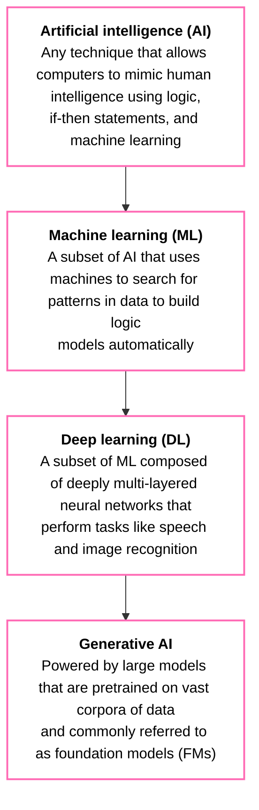
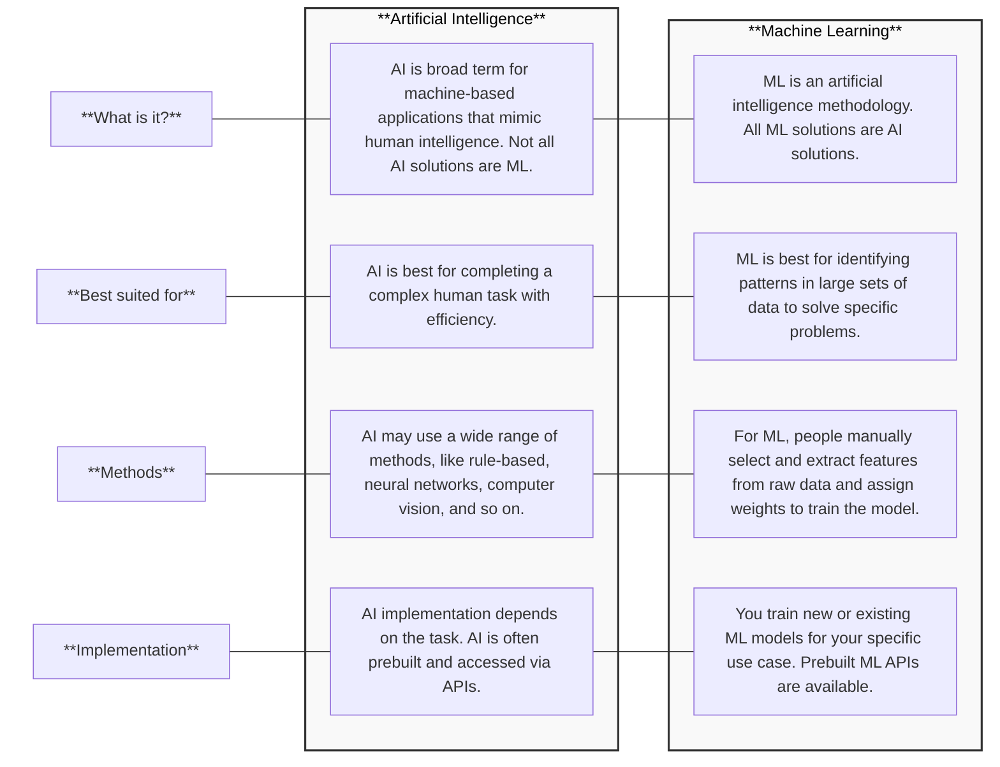
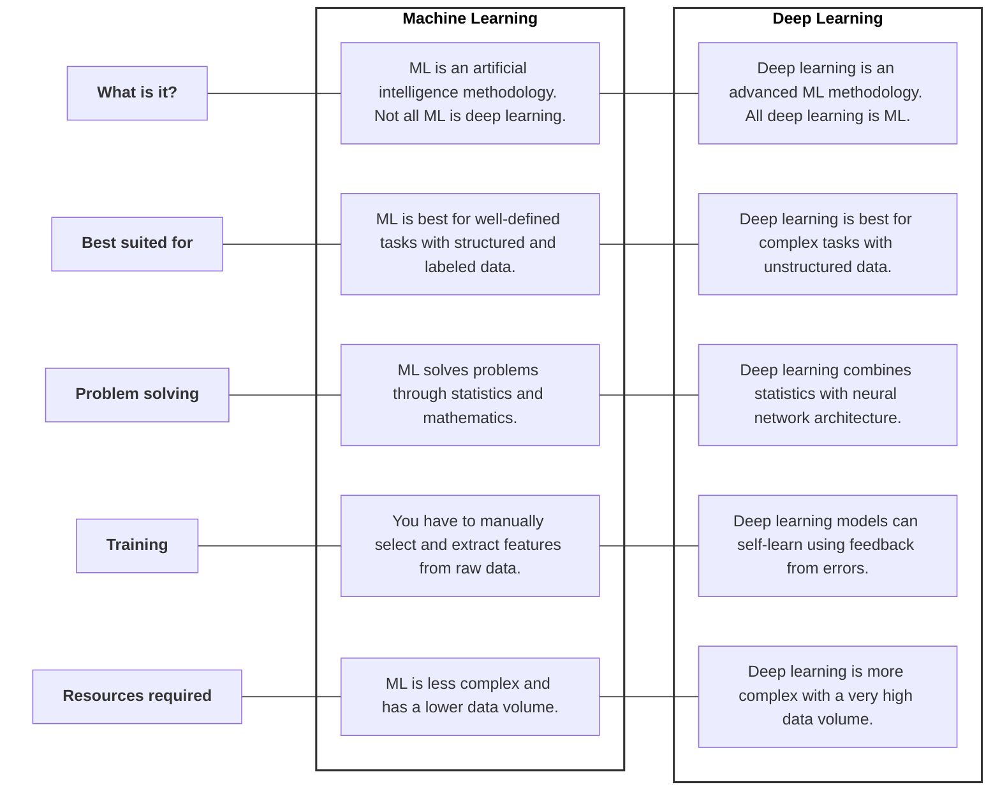

# Domain 1: Fundamentals of Machine Learning (ML) and Artificial Intelligence (AI)
# (1A: Fundamentals and Taxonomy of AI)

# High-Level Overview
## Table 1: The AI Taxonomy (Relationship Hierarchy)
| Technology | Definition & Scope | Key Characteristics |
| :--- | :--- | :--- |
| **Artificial Intelligence (AI)** | The broadest field focused on machines mimicking human intelligence. | Uses logic, if-then statements, and algorithms for perception and reasoning. |
| **Machine Learning (ML)** | A subset of AI that learns patterns from data to build models automatically. | Relies on statistical models and inference rather than explicit instructions. |
| **Deep Learning (DL)** | A subset of ML using multi-layered neural networks to mimic the human brain. | Excels at analyzing complex, unstructured data like images and natural speech. |
| **Generative AI (GenAI)** | A subset of DL powered by large, pre-trained foundation models. | Focuses on creating new content (text, audio, images) rather than just recognizing it. |

---

## Table 2: AI vs. Machine Learning (ML) Comparison
| Feature | Artificial Intelligence (AI) | Machine Learning (ML) |
| :--- | :--- | :--- |
| **Primary Objective** | Completing complex human tasks efficiently. | Identifying patterns in data to solve specific problems. |
| **Methods & Tools** | Uses rule-based systems, search algorithms, and neural networks. | Uses statistical models (e.g., linear regression) and pattern inference. |
| **Implementation** | Often involves prebuilt solutions accessed via APIs. | Involves dataset selection, model choice, and iterative refinement. |
| **Infrastructure** | Can require thousands of machines for high-computing tasks. | Generally requires hundreds of data points and moderate compute power. |
| **Similarities** | Both are branches of computer science focused on advanced data analysis and self-learning. | Both are used for complex, precise tasks like demand forecasting and self-driving systems. |

---

## Table 3: Machine Learning (ML) vs. Deep Learning (DL) Comparison
| Feature | Machine Learning (ML) | Deep Learning (DL) |
| :--- | :--- | :--- |
| **Data Suitability** | Best for structured and labeled data (e.g., customer churn). | Ideal for unstructured data like images and sentiment analysis. |
| **Problem Solving** | Uses statistics and mathematics for pattern recognition. | Combines statistics with deep neural network architectures. |
| **Feature Extraction** | **Manual:** Humans must select and extract key features from raw data. | **Automatic:** Neural networks identify and extract features without human intervention. |
| **Infrastructure** | Low to moderate; can run on a single server. | High; requires scalable cloud clusters and high-performance hardware. |
| **Interpretation** | Easier to interpret due to simpler models (e.g., decision trees). | Harder to interpret; often described as a "black box" due to complexity. |

---

## Table 4: Specialized Deep Learning Architectures
| Model (Type) | The Analogy | Best Input Data | Primary Use Case |
| :--- | :--- | :--- | :--- |
| **CNN** (Convolutional) | The Visual Designer | Images, Video | **Computer Vision:** Identifying objects in photos or stop signs for autonomous cars. |
| **RNN** (Recurrent) | The Scriptwriter | Text, Audio, Stock Prices | **NLP:** Understanding context and processing data in a specific sequence or order. |
| **GAN** (Generative Adversarial) | Student vs. Teacher | Random Noise | **Synthetic Data:** Creating realistic fake data or early-stage image generation. |

---

## Table 5: Generative AI (GenAI) Overview
| Feature | Description |
| :--- | :--- |
| **Foundation Models** | Powered by large models pre-trained on vast datasets (Foundation Models/FMs). |
| **Retraining** | Can adapt to new tasks using existing DL models without full retraining or fine-tuning. |
| **Core Value** | Shifts from "traditional" AI (recognizing patterns) to "generative" (creating new content). |
| **Enablers** | Driven by modern advances in computing power, algorithmic innovation, and data availability. |

---

# Deep Dive

## Artificial Intelligence (AI)
### Overview
* AI is a broad field that encompasses the development of intelligent systems capable of performing tasks that typically require human intelligence, such as:
  * Perception
  * Reasoning
  * Learning
  * Problem-Solving
  * Decision-Making
* AI serves as an umbrella term for various techniques and approaches, including:
  * Machine Learning
  * Deep Learning
  * Generative AI
* AI is all around us including everything from smart assistants like Alexa or Siri to robotic vacuum cleaners and self-driving cars.

## Machine Learning (ML)
### Overview
* **ML is a subset of AI** focused on creating systems that learn from data to make ***predictions*** or ***decisions***.
* ML is the science of developing ***algorithms*** and ***statistical models*** that computer systems use to perform complex tasks **WITHOUT** explicit instructions:
  * ML relies on ***patterns*** and ***inference***.
  * ML algorithms process large quantities of historial data and identify data patterns.  
* **IMPORTANT:** ML is AI, BUT not all AI activities are ML.

## Deep Learning (DL)
### Overview
* **DL is a specialized subset of ML** using ***neural networks*** with multiple layers (deep neural networks).
* **Deep Neural Networks** mimic the way the human brain processes information allowing the DL model to handle very complex tasks.
* Excels at analyzing large volumes of complex, unstructured data such as images and text (it's what allows image recongition software to identify objects in photos and voice assistants to understand natural speech).
* DL has the ability to uncover intricate patterns in unstructured data is what sets it apart from ML.

## Generative Artificial Intelligence (Gen AI)
### Overview
* **GenAI is a subset of DL** because it can adapt models built using deep learning, but without retraining or fine tuning.
* GenAI systems are capable of generating new content (e.g., text, images, audio, etc.) based on the patterns and structures learned from training data.
* So while traditional AI is focused on recognizing patterns or making decisions, GenAI is all about creating new content.
* Enabled by advances in computing power, data availability, and algorithmic innovation.

### Taxonomy

## Similarities: AI vs. ML
### Human-like Problem Solving
* Both AI and ML excel at complex , precise tasks (e.g., self-driving cars, property pricing algorithms, etc).
### Fields of Computer Science
* AI and ML are branches of computer science that enable advanced data analysis and self-learning.
### Cross-Industry Applications
* Used in supply chain, predicitive maintenance, demand forecasting, and personalized recommendations.

## Differences: AI vs. ML
### Objectives
* **AI:** Completes complex human tasks (learning, problem-solving, recognizing patterns).
* **ML:** Analyzes data to identify patterns with statistical models, giving results with a probability of correctness (learns from the data to make predictions or decisions).
### Methods
* **AI:** Utilizes genetic algorithms, neural networks, deep learning, search algorithms, rule-based systems, and ML.
* **ML:** Divided into two (2) broad categories:
  * **Supervised Learning:** Training data is labeled (predicts outcomes)
  * **Unsupervised Learning:** Training data is unlabeled (uncovers hidden patterns in the data)
### Implementations
* **AI:** Uses complex, prebuilt solutions, often via APIs for integration (AI has gone through extensive R&D to be built, allowing it to be integrated)
* **ML:** Involved dataset selection, model choice (e.g., linear regression), and refinement with error checking
### Requirements
* **AI:** Infrastructure varies; high-computing tasks may need **thousands** of machines
* **ML:** Needs **hundreds of data points** and moderate computational power (single server/small cluster)

## Summary Table: AI vs. ML (Differences)

## Similarities: ML vs. DL
### Pattern Identification
* Both train algorithms on large datasets to find correlations for predicting new data.
### AI Techniques
* ML and DL are AI subsets capable of handling complex computational tasks.
### Statistical Basis
* Use statistical methods like regression analysis; require strong statistics knowledge for development.
### Large Datasets
* Both need extensive training data for accuracy:
  * ML: 50-100 points/feature
  * DL: thousands of points
### Wide-Ranging Applications
* Used in image classification, recommendation systems, natural language processing (NLP), and predictive analytics.
### Computational Requirements
* Require complex statistical methods and significant computational resources.

## Differences: ML vs. DL
### Intended Use Cases
* **ML:** Suited for structured data (e.g., customer churn predicition).
* **DL:** Ideal for unstructured data requiring high-level abstraction (e.g., image classification, sentiment analysis).
### Problem-Solving Approach
* **ML:** Requires manual feature engineering (humans select and extract key features from the raw data to improve the model's performance). 
* **DL:** Uses neural networks for ***automatic feature extraction*** (humans DO NOT need to select and extract key features from the raw data to improve the model's performance).
### Training Methods
* **ML:** Uses supervised, unsupervised, semi-supernised, and reinforcement learning.
* **DL:** Utilizes complex algorithms/methods like:
  * **Convolutional Neural Networks (CNNs):**
    * *The Analogy:* The Visual Designer.
    * *What it does:* It scans data like a grid (images) to find patterns (edges, shapes, cats). It breaks an image down into small squares ("convolutions") to analyze features.
    * *Input Data:* Images, Video.
    * *Exam Use Case:* Computer Vision (e.g., An autonomous car seeing a stop sign, or Amazon Rekognition identifying a celebrity). 
  * **Recurring Neural Networks (RNNs):**
    * *The Analogy:* The Scriptwriter / Storyteller.
    * *What it does:* It processes data in a specific order (sequences). Unlike a CNN, it has a "memory" of what came before so it can understand context.
    * *Input Data:* Text, Audio, Time-Series data (Stock prices).
    * *Exam Use Case:* Natural Language Processing (NLP) before 2017 (e.g., Predicting the next word in a sentence, or Amazon Translate in the early days).
    * *Note:* RNNs are the ancestors of the Transformer models used in GPT/Bedrock.
  * **Generative Adversarial Networks (GANs):**
    * *The Analogy:* The Roleplay Simulation (Student vs. Teacher).
    * *What it does:* It pits two neural networks against each other:
    * *The Generator:* Tries to create a fake image (the Student).
    * *The Discriminator:* Tries to spot the fake (the Strict Teacher). They fight back and forth until the Generator gets so good the Discriminator can't tell the difference.
    * *Input Data:* Random noise → Realistic Data.
    * *Exam Use Case:* Creating Synthetic Data (e.g., generating fake patient records for testing) or early image generation. 
### Performance
* **ML:** Suitable for simpler tasks; easier to interpret due to simpler models (e.g., decision trees).
* **DL:** Excels in complex tasks (e.g., medical imaging); harder to interpret due to complexity (sometimes treated as a *black box*).
### Human Involvement
* **ML:** Requires manual feature selection and data labeling.
* **DL:** Less human intervention; uses **automatic feature extraction** and pretrained models.
### Infrastructure Requirements
* **ML:** Runs on single-server or small cluster; less resource-intensive.
* **DL:** Needs high-performance clusters and scalable cloud infrastructure, resulting in higher costs.

## Summary Table: ML vs. DL (Differences)

