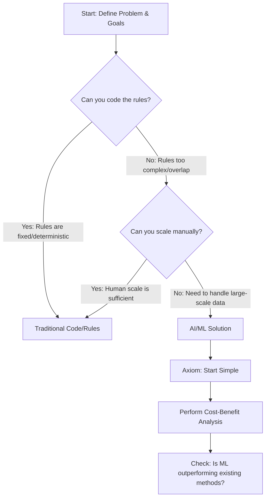

# Domain 1: Fundamentals of Machine Learning (ML) and Artificial Intelligence (AI)
# (1B: Traditional Methods vs. Artificial Intelligence Methods for Problem-Solving)

## Decision Flowchart for Using AI/ML or Using Standard Rules & Coding

---

## The Axioms
### Do you need ML to solve this problem or can you solve it using traditional code?
#### Not Always Necessary
* AI and ML are not required for every problem.
#### Cost-Benefit Analysis
* Assessing the cost-benefit of using (or not using) ML to solve a problem.
#### Start Simple
* If using ML, save time and resources by starting simple and then scaling.
#### Align with Goals
* Ensure the technology matches to business needs.

## Cost-Optimization Pillar (Well-Architected Framework)
* Identify if ML is suitable for your specific problem.
* Not every challenge requires a ML approach when it can be solved with traditional algorithms or simple rule-based systems can achieve the desired outcomes more cost-effectively.
* Perform a trade-off analysis between custom vs. pre-trained models (pre-trained models are more cost-effective since they've already been trained and require fine tuning).

## Framing the ML Problem
* Best practices to consider before adopting ML solutions.
* Clearly defining the problem you're trying to solve, identifying the most relevant data sources, and choosing the right algorithms and models.

## Is ML the Right Solution?
* **YES - When you cannot code the rules:**
    * When rules depend on too many factors and many of these rules overlap or need to be tuned very finely, you may need an ML solution.
* **YES - When you cannot scale:**
    * ML solutions are effective at handling large-scale problems.
* **EVALUATE ALTERNATIVES:**
    * If simple rule-based approaches (code) can be more effective to solve the problem.
    * Consider if ML will add unnecessary complexity. 
* **Weighing Costs:**
    * Cost of adopting ML vs. Opportunity cost of not using ML.
    * Specialized resources can be expensive and limited.

## When AI/ML may NOT be Appropriate
### Situations Requiring Specific Outcomes
  * Need for exact, deterministic results over predictions.
  * Example: Compliance checks, fixed logic operations.
### Cost-Benefit Analysis
  * High costs may outweigh benefits in some scenarios.
  * Assess if ML provides significant value addition.

## Specialized Resource Constraints
### Human Resources
  * Data Scientists' time is costly and limited for training models.
  * Model development and time-to-market considerations.
### Hardware Choices
  * Cost-effective hardware might limit experimentation speed.
  * Balance between cost and development efficiency.

## Implementation Plan: Start Simple
### Articulate the Problem
  * Clearly define objectives and the expected outcomes.
### Identify Data Sources
  * Assess data availability and quality.
### Consider Associated Costs
  * Data design and preparation expenses.
  * Storage costs for ML datasets.

## Detailed Cost Considerations
### Model Training Costs
  * Dependent on hardware choices:
    * High-performance hardware may increase costs. 
### Data Labeling Costs
  * Necessary for supervised learning models.
  * Can be significant if large datasets are involved.
### Potential Hidden Costs
  * Iterative Re-training Due to Bias:
    * *Bias* can lead to repeated model adjustments.
    * Increases time and financial investment.
  * Hosting and Maintenance:
    * Ongoing costs for model deployment.
    * Monitoring and updating models over time.  

## Weighing Costs Against Opportunity
### Assess Total Investment
  * Sum of all costs involved in ML adoption (including the hidden costs mentioned above).
### Opportunity Cost of Not Using ML
  * Potential benefits missed by not transforming with ML.

## Decision Making Criteria
### Ask: Is ML outperforming existing methods?
### Availability of Pre-Built Solutions
  * Access pre-built models and one-click deployments.
