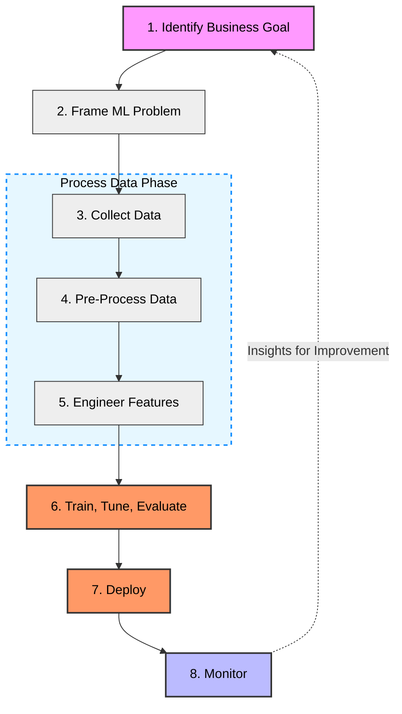

# Domain 1: Fundamentals of Machine Learning (ML) and Artificial Intelligence (AI)
# (1E: Machine Learning: Lifecycle, Sourcing Models, Deploying Models, and Operations)

# High-Level Overview

# Deep Dive

## Machine Learning Lifecycle                                            

