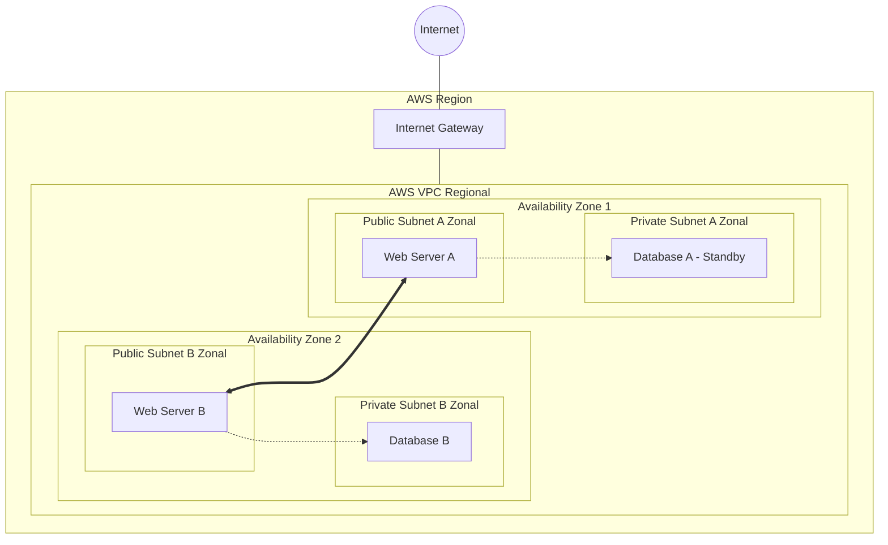
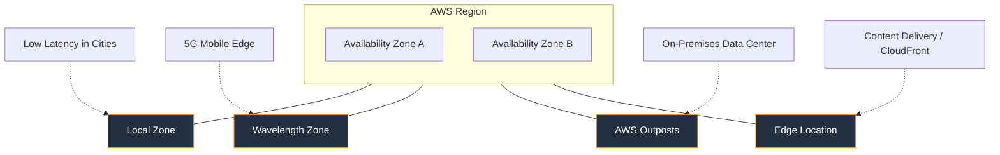

# Domain 3: Technology

## AWS Global Infrastructure (The Center)

**Regions**
   * An AWS Region is a geographical area.
   * AWS Regions are spread across the globe.
   * Each AWS Region is designed to be physically isolated from other AWS Regions, but they are connected via the AWS Global Network.
   * AWS Regions each have two or more Availability Zones (AZs).

**Availability Zones (AZs)**
   * AZs are physically isolated from each other within the AWS Region.
   * AZs are designed to be independent failure zones, thus allowing for failover.
       * Failover Design consists of launching EC2 instances in mutliple AZs, so if one AZ goes down, the EC2 instance in the other AZ can pick up the traffic.
       * Failovers can be masked by using Elastic IP addresses.
   * Each AZ has one or more Data Centers within them.
   * Data Centers within an AZ are networked together with redundant, low latency, and high throughput connections.
   * Data Centers within an AZ also have redundant power supplies.

**Internet Traffic Flow into the Cloud (High-Level Overview)**

1. Internet traffic flows into an AWS Region.
2. A Virtual Private Cloud (VPC) inhabits the AWS Region (think of VPCs as the same as Regions - VPCs are Regions, essentially).
3. Internet traffic enters the VPC through an Internet Gateway (IGW).
4. Once inside the VPC, traffic flows into one of the AZs.
5. Once inside the AZ, traffic flows into one of the public subnets (traffic cannot access private subnets).
6. Once inside the subnet, traffic flows into the EC2 instance inside that subnet.

**NOTES ABOUT PRIVATE SUBNETS:**
  * Private subnets are **inaccessible** to internet traffic (the internet doesn't even see the private subnet).
  * If something is needed from the private subnet (for example, a record or some data that is stored), the request is routed through an application in the public subnet first (think of a receptionist routing a message to the back office and then returning a response to the front desk).
  * The only way private subnets are accessible to Administrators are via the AWS Systems Manager or through a Bastion Host "Jump Box" and then SSH jumping into the private subnet (this is the traditional way, the modern way is using AWS Systems Manager).
  * Private subnets can send traffic **OUT** into the internet through a NAT Gateway positioned in a public subnet. 

## AWS Global Infrastructure (The Ecosystem)

**AWS Outposts**
   * A fully managed service that extends AWS infrastructure, services, and APIs to virtually any **on-premises** data center or co-location space.
   * Provides a **consistent experience** because you use the same AWS Console and tools to manage on-prem resources as you do for cloud resources.
   * **AWS Direct Connect:** A service where a physical fiber optic connection between the AWS Outpost infrastrucutre and the on-prem infrastructure creates a low latency, high throughput, and secure connection (standard connection is using the public internet with a Virtual Private Network (VPN) connection). 
   * Primary Use Cases:
     * Low Latency: When applications need to talk to local equipment in milliseconds (e.g., factory floor robotics).
     * Local Data Processing: When data is too heavy to move to the cloud quickly.
     * Data Residency: Complying with regulations (like GDPR) that require data to stay within a specific physical building or country.
   * Responsibility: AWS ships, installs, and manages the hardware; the **customer** provides the "floor space," power, and cooling.

**AWS Local Zones**
   * An extension of an AWS Region that places compute and storage services close to large population centers (cities).
   * Provides single-digit millisecond latency for high-performance apps (e.g., real-time gaming, VR/AR, media production).
   * Managed entirely by AWS; you gain the benefit of "Edge" computing without managing your own hardware.
   * You must enable the Local Zone in your AWS Account settings before use.

**AWS Wavelength Zones**
   * AWS infrastructure deployments that embed AWS compute and storage services within **5G networks** of telecommunications providers.
   * Provides **ultra-low latency** (single-digit milliseconds) specifically for mobile devices and users on cellular networks.
   * Primary Use Cases:
      * Connected Vehicles: Real-time monitoring and autonomous driving safety.
      * AR/VR on Mobile: Delivering immersive experiences to phones without lag.
      * Healthcare: Real-time medical image analysis during remote procedures.
      * Smart Factories: Processing IoT data from sensors on 5G-connected robots.

**AWS Edge Locations**
   * A global network of Points of Presence (PoPs) used to deliver content (videos, images, multimedia) to end users with the lowest possible latency.
   * The Content Delivery Network (CDN) Connection: Their primary purpose is to host Amazon CloudFront, AWS’s Content Delivery Network (CDN).
   * How it Works: Instead of a user in London fetching an image from a server in North Virginia, they fetch a cached copy from the London Edge Location.
   * Edge Location: Small, numerous, and closest to the user.
   * Regional Edge Cache: Larger caches that sit between your Origin and the Edge. If the Edge doesn't have the file, it checks here first before bothering your main server.
   

## Amazon Elastic Compute Cloud (EC2)

**EC2 Overview and Basics**
   * Amazon Elastic Compute Cloud (EC2) is an AWS service that lets you easily use compute resources in the Cloud.
   * You run virtual instances/machines in the Cloud when you use Amazon EC2.
   * Amazon EC2 instances can run Linux, Windows, or MacOS.
   * The instances are **elastic** allowing you to provision additional servers when needed and terminate unused or underutilized servers when you no longer need them.
      * **NOTE:** Scaling is NOT automatic by default. You will need to set the rules in the AWS Management Console and configure the Auto-Scaling Groups (ASGs) to scale your EC2 instances when necessary.
      * The ASGs will scale **horizontally** since this is not disruptive.
      * Vertical scaling is available to perform manually, but it's disruptive (requires you to stop/start the instance) and defeats the purpose of the Cloud's elasticity (horizontal scaling and distributing the workload). 
   * You can select different instance types with varying combinations of CPU, memory, storage, networking, and OS:
      * Family/Generation: Examples: Main/General Purpose (M), Compute Intensive (C), Graphics Intensive (G), Data (D), RAM (R), Cheap (T), Fast (F), High Memory (U), High Compute + Memory (Z), High Disk Throughput (H), etc.  
      * Volume/Size: Nano, Micro, Small, Medium, Large, X-Large, 2X-Large - just remember the next size is double the previous size.  
   * You pay only for what you use.
   * AWS manages the physical underlying infrastructure (host) and the virtualization layer (hypervisor), while the users manage their VMs and resources in the Cloud.
   * EC2 is IaaS: AWS manages the underlying hardware and you manage everything else from the OS (platform) and up.
   * EC2 instances "sit" inside the public or private subnet within the AZ, which "sits" within the (regional) VPC.

**Virtualization**
   * EC2 works via virtualization technology.
   * The physical server uses virtualization software, which creates a **hypervisor** over the physical server (enabled by using virtualization software such as Zen, Microsoft V, KVM, etc.).
   * The hypervisor creates a layer of "abstracton" between the physical server and the virtual server by allocating resources from the physical hardware into the virtual machine (VM) including the memory, storage, networking, and CPU power.
   * Virtual Machines are also referred to as virtual servers or virtual instances.
   * Virtualization allows you to run multiple VMs on the same physical server.
   * Virtualization allows portability allowing you to move the VM to different physical servers (it resolves the limitation of having the OS tied to a specific piece of hardware).
   * Virtualization allows scaling - allowing you to spread your VMs across multiple physical servers.

**EC2 Benefits**
   * Elastic: increase/decrease capacity to meet demand fluctuations and web traffic spikes.
   * Reliable: highly reliable environment where replacement instances can be provisioned rapidly with **Regional** service-level agreements (SLAs) of 99.99% **if architected for High Availability** (i.e., EC2 instances are spread across multiple AZs in a Region with an elastic load balancer and an ASG to distribute and handle the load while the first failed EC2 instance is repaired and brought back online (this is also known as "self-healing" architecture: High Availability (HA) + Fault Tolerance (FT)).
   * Inexpensive: Amazon passes on the benefit of economies of scale to the users.
   * Integrated: EC2 instances are integrated with a wide variety of AWS services (including S3, RDS, and VPC) so you can build complete services within the Cloud.
   * Secure: EC2 works inconjunction with the VPC to provide a secure location with an IP address range you can configure to allow access to your EC2 (in combination with network security measures like Network Access Control Lists (Network ACLs) protecting your subnet boundaires, Web Application Firewalls (WAFs) protecting your application load balancers (ALB), and Security Groups protecting the EC2 instance itself).

