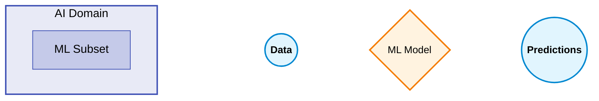

# Domain 3: Technology
# (3H: Migration Services, Artificial Intelligence >> Machine Learning >> Deep Learning)

# High-Level

# Deep Dive

## AWS Migration Hub
  * ### Overview
    * Provides a single location to track the progress of application migrations across multiple AWS and partner solutions.
  * ### AWS Database Migration Service (DMS)
    * Helps you migrate databases to AWS quickly and securely.
    * The source database remains fully operational during the migration, minimizing downtime to applications that rely on the database.
  * ### AWS Server Migration Service (SMS)
    * Migrates servers and VMs to EC2.
    * Agentless service which makes it easier and faster to migrate thousands of on-premises workloads to AWS.
    * Automates, schedules, and tracks incremental replications of live server volumes.
  * ### AWS DataSync
    * Online data transfer service.
    * Transfer data between on-premises and AWS storage services.
  * ### AWS Snowball Family
    * #### AWS Snowball and Snowmobile
      * Used for migrating large volumes of data to AWS.
      * Uses a secure storage device for PHYSICAL transportation.
      * **SNOWBALL** has 80TB or 50TB transfer capability (petabyte scale achieved with multiple SNOWBALLS).
      * **SNOWBALL EDGE** has 100TB transfer capability (petabyte scale achieved with one SNOWBALL EDGE).
      * **SNOWMOBILE** is at *exabyte* scale with up to 100PB (petabytes) per SNOWMOBILE.
    * #### Snowball Edge Compute Optimized
      * Provides block an object storage along with an optional GPU.
      * Good for edge computing use cases.
    * #### Snowball Edge Storage Optimized
      * Provides block storage and Amazon S3-compatible object storage.
      * Use for local storage and large-scale data transfer.
    * #### Snowcone
      * Small device used for edge computing, storage and data transfer.
      * Can transfer data offline or online with AWS DataSync agents.       

## Artificial Intelligence --> Machine Learning --> Deep Learning
  * ### Overview
    * #### Artificial Intelligence (AI)
      * A broad field where intelligent systems are capable of performing human-like tasks.
    * #### Machine Learning (ML)
      * A type of AI used for training machines to perform complex tasks without explicit instructions.
      * ML "training" feeds data into the machine to **find patterns** hidden in the data, which produces a **MODEL**.
      * The model can then be trained on other data sets to make predictions or decisions based on the patterns it learned.
      * **Common Use Cases for ML Models:**
        * Predict trends (e.g., stock prices)
        * Make decisions (e.g., routing callers to departments)
        * Detect anomalies (e.g., bank fraud)
        * AI services (e.g., pre-built models already trained)
       

      
  * ### Amazon Rekognition
    *  
  * ### Amazon Transcribe
  * ### Amazon Translate
  * ### Amazon Comprehend
  * ### Amazon Lex
  * ### Amazon Polly
  * ### Amazon SageMaker
  * ### Amazon Bedrock
  * ### Amazon DevOps Guru
  * ### Amazon CodeGuru Security
